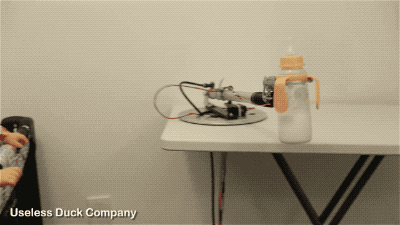

 

# Humble Flask Beginnings

Frameworks are ubiquitous in computing. There are frameworks for front and backend web development, mobile development, desktop development, game development, IoT development, robotics development, and more. Frameworks are ubiquitous because much of development in a given context is the same which begs the question "why reinvent the wheel for each project?" A framework then is a collection of solutions to common problems in a given context such as front or backend web development. In computer science this generalized approach to problem solving is called abstraction and it's the first principle of object-oriented programming. When problems are recurrent, we create abstractions to solve them in such a way the abstractions are reusable in different projects. Django, Ruby of Rails, Laravel, Spring, etc... are all backend web frameworks in various languages that essentially do the same thing. They make web development easier by providing solutions (i.e. abstractions) for common web development problems.

You will often hear about two types of frameworks: frameworks and micro-frameworks. Frameworks take a "batteries included" approach in that they attempt to include everything a typical application might need. For a web application, this includes request routing, a database abstraction layer, user authentication and authorization, form generation and validation, cross-site request forgery protection, and pretty much anything else you can think of that a website might need. The abstractions frameworks provide are intended to make web developers more productive, because without them we would have to start from scratch for each project.

Micro-frameworks, on the other hand, take a minimalist approach. They provide a few core features and a structure for extending the framework when needed. Such an approach is sometimes necessary because not all websites need the abstractions frameworks provide. Brochure websites, for example, frequently don't require user authentication and authorization. An HTML template engine is unnecessary for an API serving JSON. Websites with specific requirements may need these things, but abstractions provided by a framework may not be optimal for a given use-case. In such cases, experienced developers may need to create a tailored solution for their needs without fighting a framework to do it.

In this lesson we'll cover Flask. Flask is a Web micro-framework popular in the Python community for its simplicity and extensibility. Applications written in Flask can be as simple as a single file or as complex as any created with other frameworks. It's up to you and your needs. The goal of this assignment is to gently introduce concepts of Web development common among Web development frameworks. We're going to expand on the Hello World walkthrough to act as a very basic recipe box. Use [http://flask.pocoo.org/docs/1.0/quickstart/ ](http://flask.pocoo.org/docs/1.0/quickstart/) as a reference for this.

- Create a new virtualenv using pipenv
- Download your "database" from here: [https://gist.github.com/itsthejoker/b8e6b8212d3a9ce29320296e2b01b93f ](https://gist.github.com/itsthejoker/b8e6b8212d3a9ce29320296e2b01b93f)
    - Just click on "raw", copy the contents, and paste them into a file called "db.json" in your project directory
- Use [https://tinydb.readthedocs.io/en/latest/getting-started.html#basic-usage ](https://tinydb.readthedocs.io/en/latest/getting-started.html#basic-usage) to load in the json file you downloaded
- Add one HTML template located at the root path ('/') and use the documentation here: [http://flask.pocoo.org/docs/1.0/quickstart/#rendering-templates ](http://flask.pocoo.org/docs/1.0/quickstart/#rendering-templates) to build your template
- In your index view, your app should get one recipe at random (see `db.all()`) from the "database", pass it to the template, and send the template to the web browser

When you're happy with it, create a repository on your personal Github account with the code. Submit the link to the repo to complete.

Side note: do not hard-code any paths in your application (for example: `/Users/jkaufeld/Documents/github/...`). It's a bad practice to hard-code any values, and for assignments going forward, it will make testing on a different computer more difficult. Always use environment variables (`TINYDB_PATH=/Users/jkaufeld/Documents/github/...`).

## To Use:

- Create virtual environment: `pipenv install --python=3.7`.
- Start running the virtual environment: `pipenv shell`.
    - Should see `Pipfile` and `Pipfile.lock`.
- Exit virtual environment: `exit`.
- To install anything: `pipenv install <whateverYouWant>`.
- It's a good idea to let the program reload based on code changes and to enable the development and debug features: `export FLASK_ENV=development`.
- To run with Flask, once it's installed: `flask run` or `python -m flask run`.
    - Make sure you have entered this in the terminal to set flask to the correct filename to run it: `o	export FLASK_APP=filename.py`.

## HAVE FUN :)